# ЛР1. Работа с сокетами

Цель работы: понять принципы межсокетного взаимодействия в вебе и научиться реализовывать базовую архитектуру клиент-сервер.

Код лежит рядом с отчетом, для каждого задания своя папка от `task1` до `task5`. Скрипты я запускал из этих папок. Везде используется только стандартная библиотека Python, сервер слушает `localhost:8080`.

## Практическое задание 1. Обмен сообщениями по UDP

UDP работает без установления соединения. Сервер просто привязывает сокет к адресу и ждет датаграмму. Метод `recvfrom` возвращает не только данные, но и адрес отправителя, по нему сервер и отвечает через `sendto`. Клиенту `connect` не нужен.

Сервер:

```python
import socket

server = socket.socket(socket.AF_INET, socket.SOCK_DGRAM)
server.bind(("localhost", 8080))
print("Сервер запущен")

while True:
    data, addr = server.recvfrom(1024)
    print(f"Сообщение от {addr}: {data.decode()}")
    server.sendto("Hello, client".encode(), addr)
```

Клиент:

```python
import socket

client = socket.socket(socket.AF_INET, socket.SOCK_DGRAM)
client.sendto("Hello, server".encode(), ("localhost", 8080))

data = client.recv(1024)
print(f"Ответ сервера: {data.decode()}")
client.close()
```

Пример работы. Сервер:

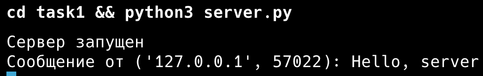

Клиент:

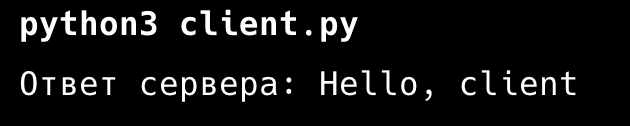

## Практическое задание 2. Вычисления через TCP

Мой вариант первый, теорема Пифагора. Клиент спрашивает у пользователя два катета, отправляет их серверу одной строкой через пробел, сервер считает гипотенузу и отправляет ответ.

В отличие от UDP здесь сначала устанавливается соединение. Сервер вызывает `listen`, потом в цикле `accept`, и для каждого клиента получает отдельный сокет `conn`. После ответа соединение закрывается. Опцию `SO_REUSEADDR` я поставил, чтобы после перезапуска сервера порт сразу был свободен.

Если ввести не числа или отрицательный катет, сервер не падает, а возвращает текст ошибки.

Сервер:

```python
import math
import socket

server = socket.socket(socket.AF_INET, socket.SOCK_STREAM)
server.setsockopt(socket.SOL_SOCKET, socket.SO_REUSEADDR, 1)
server.bind(("localhost", 8080))
server.listen(1)
print("Сервер запущен")

while True:
    conn, addr = server.accept()
    print(f"Подключился {addr}")
    data = conn.recv(1024).decode()
    try:
        a, b = map(float, data.split())
        if a <= 0 or b <= 0:
            answer = "Катеты должны быть больше нуля"
        else:
            answer = f"Гипотенуза: {math.sqrt(a ** 2 + b ** 2):.4f}"
    except ValueError:
        answer = "Нужно передать два числа"
    print(f"Катеты: {data}, ответ: {answer}")
    conn.send(answer.encode())
    conn.close()
```

Клиент:

```python
import socket

a = input("Введите первый катет: ")
b = input("Введите второй катет: ")

client = socket.socket(socket.AF_INET, socket.SOCK_STREAM)
client.connect(("localhost", 8080))
client.send(f"{a} {b}".encode())

print(client.recv(1024).decode())
client.close()
```

Пример работы. Обычный запрос:

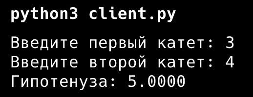

Вместо числа ввел текст:

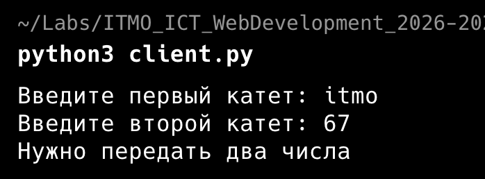

Отрицательные катеты:

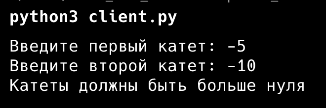

Все три запроса на стороне сервера:

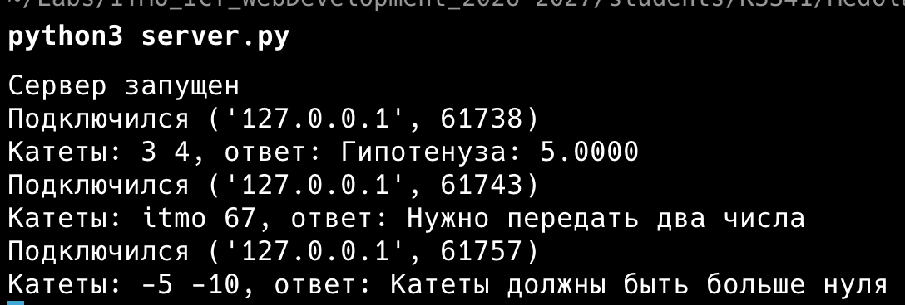

## Практическое задание 3. Раздача HTML-страницы по HTTP

HTTP-ответ это обычный текст: строка статуса, заголовки, пустая строка и тело. Я читаю `index.html` в байтах, чтобы `Content-Length` совпал с реальной длиной. Если читать как строку, русские буквы в UTF-8 занимают по два байта и длина получится неправильной. Заголовки и тело отправляются одним вызовом `sendall`.

Сервер:

```python
import socket

server = socket.socket(socket.AF_INET, socket.SOCK_STREAM)
server.setsockopt(socket.SOL_SOCKET, socket.SO_REUSEADDR, 1)
server.bind(("localhost", 8080))
server.listen(1)
print("Сервер запущен на http://localhost:8080")

while True:
    conn, addr = server.accept()
    request = conn.recv(1024).decode()
    print(request.split("\r\n")[0])

    with open("index.html", "rb") as f:
        body = f.read()

    headers = (
        "HTTP/1.1 200 OK\r\n"
        "Content-Type: text/html; charset=utf-8\r\n"
        f"Content-Length: {len(body)}\r\n"
        "Connection: close\r\n"
        "\r\n"
    )
    conn.sendall(headers.encode() + body)
    conn.close()
```

Страница `index.html`:

```html
<!DOCTYPE html>
<html lang="ru">
<head>
    <meta charset="UTF-8">
    <title>Лабораторная работа 1</title>
</head>
<body>
    <h1>Привет!</h1>
    <p>Эту страницу отдал сервер на сокетах.</p>
</body>
</html>
```

Страница в браузере:

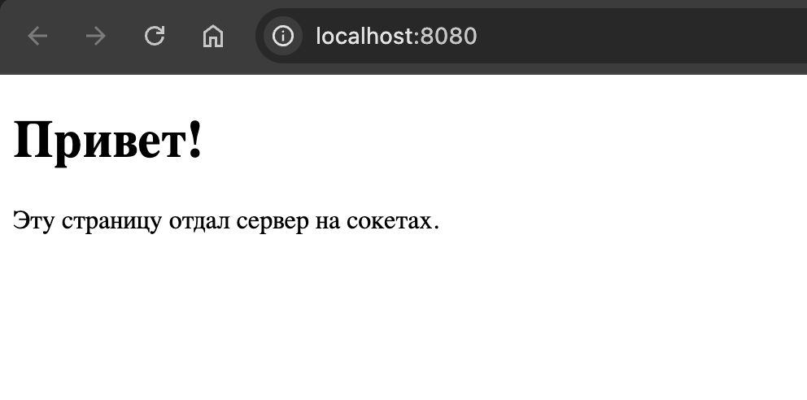

Сервер:

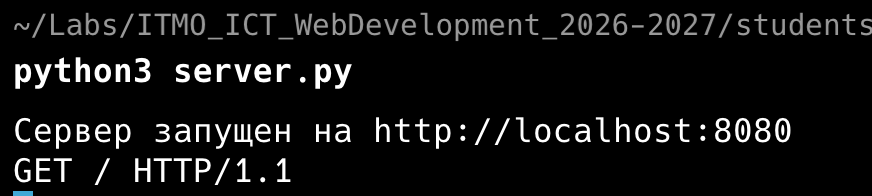

Заголовки ответа через curl:

```text
$ curl -i http://localhost:8080
HTTP/1.1 200 OK
Content-Type: text/html; charset=utf-8
Content-Length: 264
Connection: close

<!DOCTYPE html>
...
```

## Практическое задание 4. Чат на сокетах

Я сделал многопользовательский чат на TCP с потоками.

Сервер хранит словарь `clients`, где ключ это сокет подключения, а значение имя пользователя. На каждое новое подключение запускается отдельный поток с функцией `handle`. Первым сообщением клиент присылает свое имя, так пользователи и различаются. Все следующие сообщения сервер рассылает остальным участникам с подписью отправителя. Словарь меняют сразу несколько потоков, поэтому доступ к нему закрыт через `threading.Lock`.

Выйти можно командой `/exit` или просто закрыв клиент. В обоих случаях сервер удаляет пользователя из словаря и сообщает остальным, что он вышел.

Клиент один на всех. Каждый пользователь запускает тот же `client.py` в своем терминале и вводит имя. Прием сообщений идет в отдельном потоке, иначе клиент не видел бы чужие сообщения, пока ждет ввода в `input`.

Сервер:

```python
import socket
import threading

clients = {}
lock = threading.Lock()


def broadcast(message, sender=None):
    with lock:
        for conn in list(clients):
            if conn != sender:
                try:
                    conn.send(message.encode())
                except OSError:
                    pass


def handle(conn):
    name = conn.recv(1024).decode().strip()
    with lock:
        clients[conn] = name
    print(f"{name} подключился")
    broadcast(f"{name} вошел в чат", conn)

    while True:
        try:
            data = conn.recv(1024)
        except OSError:
            break
        if not data:
            break
        message = data.decode()
        if message == "/exit":
            break
        print(f"{name}: {message}")
        broadcast(f"{name}: {message}", conn)

    with lock:
        del clients[conn]
    conn.close()
    print(f"{name} отключился")
    broadcast(f"{name} вышел из чата")


server = socket.socket(socket.AF_INET, socket.SOCK_STREAM)
server.setsockopt(socket.SOL_SOCKET, socket.SO_REUSEADDR, 1)
server.bind(("localhost", 8080))
server.listen()
print("Сервер чата запущен")

while True:
    conn, addr = server.accept()
    threading.Thread(target=handle, args=(conn,), daemon=True).start()
```

Клиент:

```python
import socket
import threading


def receive(client):
    while True:
        try:
            data = client.recv(1024)
        except OSError:
            break
        if not data:
            break
        print(data.decode())


name = input("Ваше имя: ")

client = socket.socket(socket.AF_INET, socket.SOCK_STREAM)
client.connect(("localhost", 8080))
client.send(name.encode())
print("Вы в чате. Для выхода напишите /exit")

threading.Thread(target=receive, args=(client,), daemon=True).start()

while True:
    message = input()
    if not message:
        continue
    client.send(message.encode())
    if message == "/exit":
        break

client.close()
```

Пример работы с тремя пользователями. Андрей зашел первым, потом Маша и Петя. Андрей попрощался и вышел командой `/exit`.

Терминал Андрея:

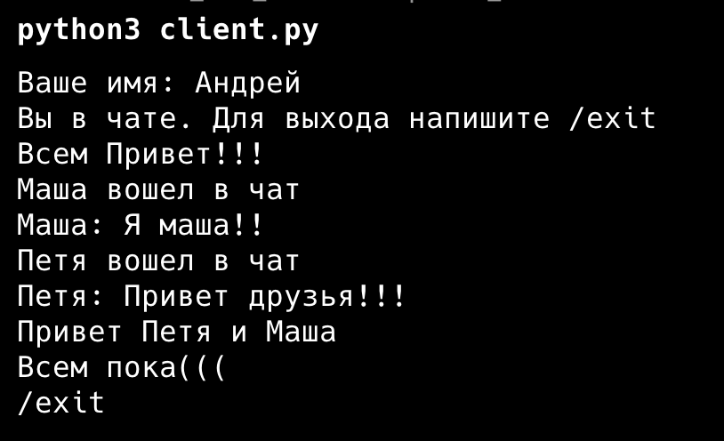

Терминал Маши:

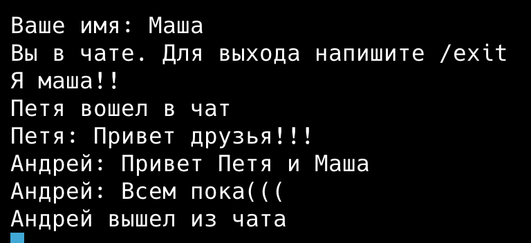

Терминал Пети:

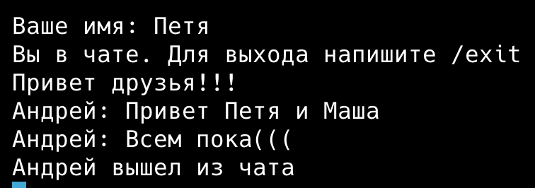

Сервер:

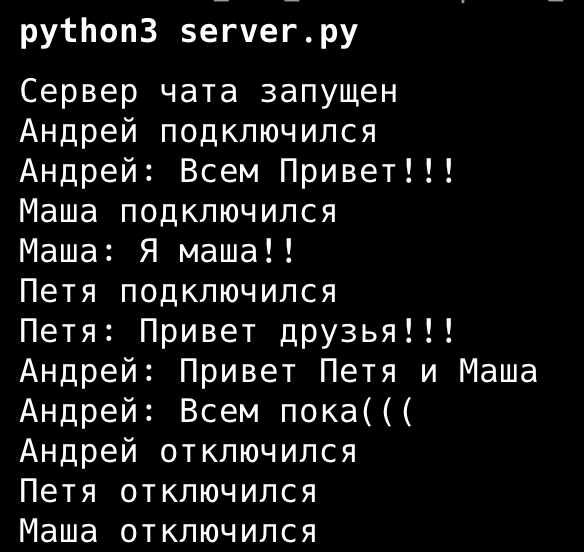

## Практическое задание 5. Простой веб-сервер (GET/POST)

Здесь сервер сам разбирает HTTP-запрос. Сначала я делю данные по первой пустой строке `\r\n\r\n` на заголовки и тело. Из первой строки берутся метод и путь. Заголовки складываются в словарь, из него нужен только `Content-Length`. Если тело пришло не целиком, сервер дочитывает его, пока длина не совпадет.

Оценки хранятся в словаре, где ключ это дисциплина, а значение список оценок. Так две оценки по математике попадают в одну запись, а не в две строки. Новая оценка добавляется через `setdefault`, он создает пустой список для нового предмета.

GET на `/` возвращает страницу с таблицей оценок и формой. Форма отправляет POST на тот же адрес. Тело POST приходит в виде `subject=...&grade=...`, его разбирает `parse_qs`, заодно он декодирует русские буквы из процентной кодировки. После успешного POST сервер отвечает `303 See Other` и перенаправляет на главную, чтобы при обновлении страницы форма не отправлялась повторно. Если поле пустое, будет `400`, на неизвестный путь `404`.

```python
import socket
from urllib.parse import parse_qs

grades = {}


def make_page():
    rows = ""
    for subject, marks in grades.items():
        rows += f"<tr><td>{subject}</td><td>{', '.join(marks)}</td></tr>"
    return f"""<!DOCTYPE html>
<html lang="ru">
<head><meta charset="UTF-8"><title>Журнал оценок</title></head>
<body>
<h1>Журнал оценок</h1>
<table border="1">
<tr><th>Дисциплина</th><th>Оценки</th></tr>
{rows}
</table>
<h2>Добавить оценку</h2>
<form method="POST" action="/">
<input name="subject" placeholder="Дисциплина" required>
<input name="grade" placeholder="Оценка" required>
<button type="submit">Отправить</button>
</form>
</body>
</html>"""


def send_response(conn, status, body=""):
    body = body.encode()
    headers = f"HTTP/1.1 {status}\r\nContent-Type: text/html; charset=utf-8\r\nContent-Length: {len(body)}\r\n"
    if status.startswith("303"):
        headers += "Location: /\r\n"
    conn.sendall((headers + "\r\n").encode() + body)


server = socket.socket(socket.AF_INET, socket.SOCK_STREAM)
server.setsockopt(socket.SOL_SOCKET, socket.SO_REUSEADDR, 1)
server.bind(("localhost", 8080))
server.listen()
print("Сервер запущен на http://localhost:8080")

while True:
    conn, addr = server.accept()
    data = conn.recv(4096)
    if not data:
        conn.close()
        continue

    head, _, body = data.partition(b"\r\n\r\n")
    lines = head.decode().split("\r\n")
    method, path = lines[0].split()[:2]
    print(method, path)

    headers = {}
    for line in lines[1:]:
        key, _, value = line.partition(":")
        headers[key.lower()] = value.strip()

    length = int(headers.get("content-length", 0))
    while len(body) < length:
        body += conn.recv(4096)

    if method == "GET" and path == "/":
        send_response(conn, "200 OK", make_page())
    elif method == "POST" and path == "/":
        params = parse_qs(body.decode())
        subject = params.get("subject", [""])[0].strip()
        grade = params.get("grade", [""])[0].strip()
        if subject and grade:
            grades.setdefault(subject, []).append(grade)
            send_response(conn, "303 See Other")
        else:
            send_response(conn, "400 Bad Request", "<h1>Нужно указать дисциплину и оценку</h1>")
    else:
        send_response(conn, "404 Not Found", "<h1>Страница не найдена</h1>")

    conn.close()
```

Пример работы. Я добавил несколько оценок через форму в браузере, по некоторым предметам больше одной:

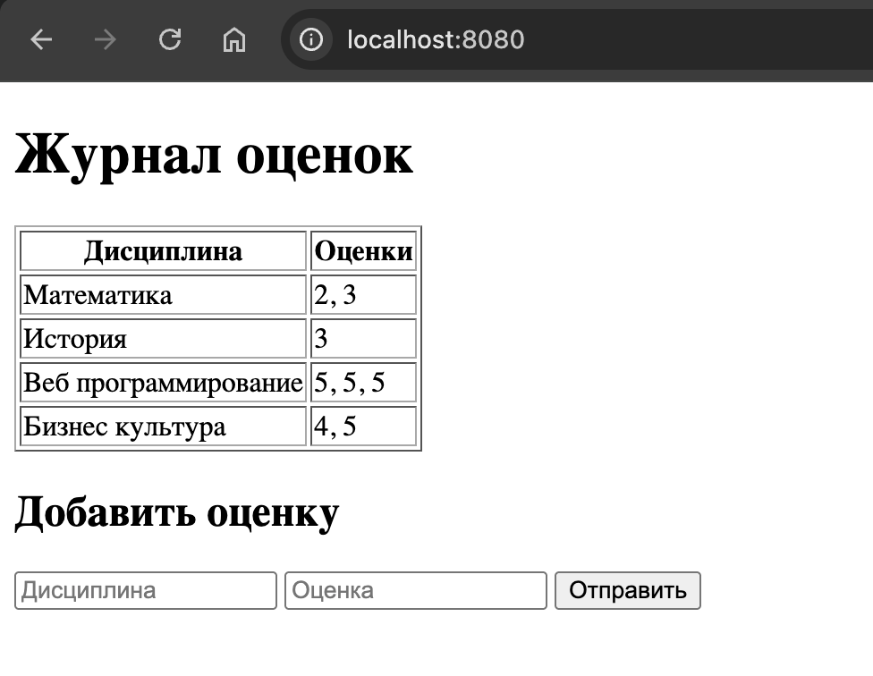

Математика записалась одной строкой с двумя оценками, а у веб программирования в одной строке сразу три оценки. Отдельных строк с одинаковым названием дисциплины нет, как и требуется.

Сервер после каждого POST отвечает перенаправлением, поэтому браузер сразу делает GET:

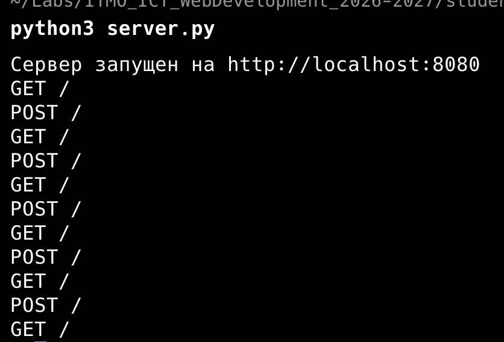

Проверка ошибок:

```text
$ curl -si -d "subject=&grade=5" http://localhost:8080/ | head -1
HTTP/1.1 400 Bad Request
$ curl -si http://localhost:8080/abc | head -1
HTTP/1.1 404 Not Found
```

## Вывод

Все пять заданий работают. Проще всего был UDP, там хватило `sendto` и `recvfrom`. Остальное я делал на TCP, потому что там данные доходят целиком и по порядку.

Сложнее всего получился чат. Словарь клиентов меняют сразу несколько потоков, поэтому без блокировки при одновременном входе и выходе пользователей рассылка могла упасть. В пятом задании HTTP-запрос пришлось разбирать руками, и это оказался обычный текст, который несложно разделить на части.
